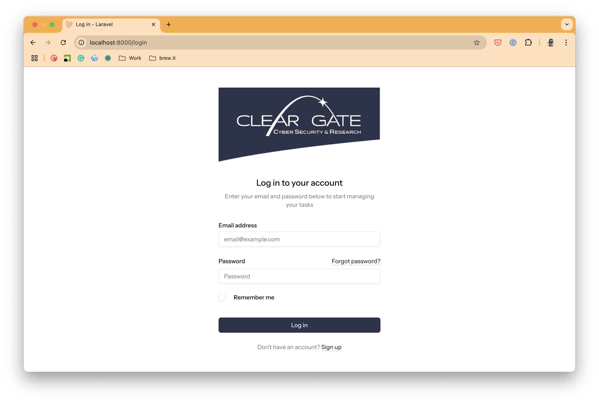
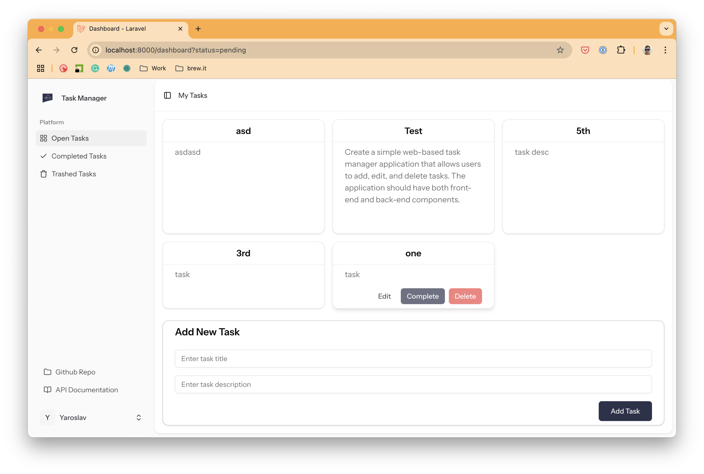

# Task Manager Application

A Laravel 12 application with Vue.js 3 for managing tasks with user authentication.

## Features

- User Authentication with Laravel Sanctum
- Task Management (Create, Read, Update, Delete)
- API with proper validation and authorization
- Integration with Vue.js 3 frontend
- Comprehensive tests for all features

## Requirements

- Docker and Docker Compose

## Getting Started

### Setup with Docker

1. Clone the repository
   ```
   git clone https://github.com/yaroslav-pohil/clear-gate.git
   cd clear-gate
   ```

2. Copy the environment file
   ```
   cp .env.example .env
   ```

3. Start the Docker containers
   ```
   docker-compose up -d
   ```

4. Install PHP dependencies
   ```
   docker-compose exec php composer install
   ```

5. Generate application key
   ```
   docker-compose exec php php artisan key:generate
   ```

6. Run migrations and seed data
   ```
   docker-compose exec php php artisan migrate --seed
   ```

### Accessing the Application

- Frontend: http://localhost:8000
- API: http://localhost:8000/api
- Database: http://127.0.0.1:3306 (Check credentials in .env)

## API Documentation

The API is documented using a Postman collection. Import the `task_manager_api.postman_collection.json` file into Postman to explore and test the API endpoints.

If everything is ok, the application login page will look like this:



and the dashboard page will look like this:



## Testing

To run tests:

```
docker-compose exec php php artisan test
```

## Stopping the Application

To stop the Docker containers:

```
docker-compose down
```

To stop and remove volumes (this will delete your database data):

```
docker-compose down -v
```
